# 전략적 배포를 위한 GoCD OSS 사용기 

[ 공식 사이트 ] https://www.gocd.org/

## 1. GoCD 소개

GoCD는 Jekins의 CI/CD 툴과 다르게 CD(Continuous Delivery)에 특화되어 있는 툴입니다.  Server와 Agent  구조기반의 동작 매커니즘을 가지고 있으며 Agent가 Server를 주기적으로 Polling 하다가 파이프라인 수행 이벤트가 발생하면 Task를 받아서 Agent 로컬에서 수행하는 구조입니다.

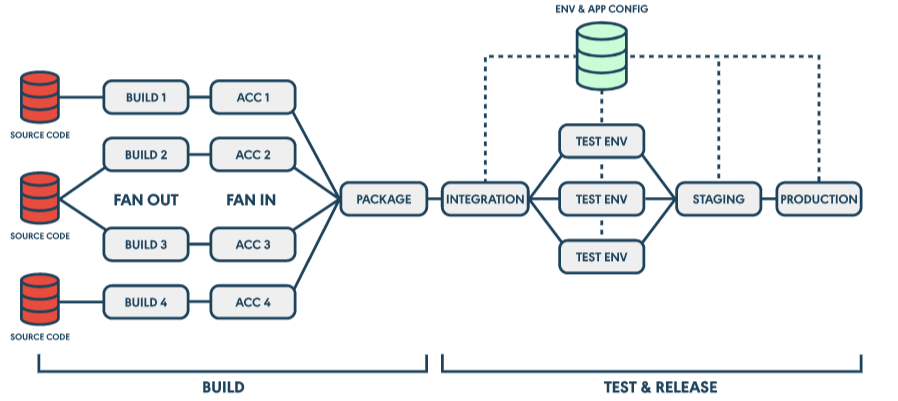

Task는 명령어 한줄에 대응하여 성공/실패 여부를 엄격하게 판단하고 로그로 남깁니다. (Jenkin 보다 강력하고 엄격하게 처리)  기본으로 제공한는 Task  번들로는 Ant , Nant , Rake 를 제공하고 있고 shell excuter 은 없기 때문에 Plug-in 설치를 해야합니다. 이 모습을 통해서 GoCD의 Shell 명령어 사용을 지향하는 방향성을 엿볼 수 있습니다. 

* **GoCD Job** 

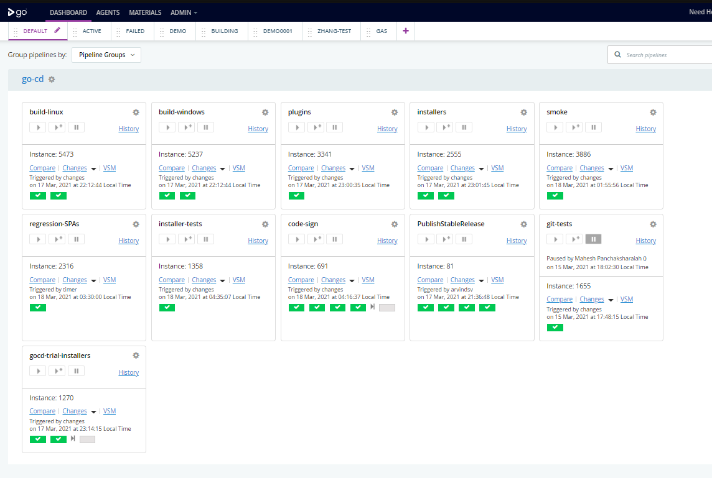

* **GoCD PipeLine Demo**

* **Task Demo**

## 2. GoCD와 Jenkins의 차이점

지속적 배포를 수행 중이거나 수행하려는 경우 견고한 Jenkins 대안 인 GoCD를 사용해야합니다. GoCD는 초보자와 배포 파이프 라인 구축 경험이 많은 사용자 모두에게 적합합니다. 방대한 플러그인 카탈로그를 활용하여 다양한 작업을 자동화하려면 Jenkins가 더 적합 할 수 있습니다. 다음은 GoCD와 Jenkins의 높은 수준 비교입니다.

|               |                             GoCD                             |                            젠킨스                            |
| :------------ | :----------------------------------------------------------: | :----------------------------------------------------------: |
| 철학          |    GoCD는 CD (지속적 배포)를위한 동급 최고의 도구입니다.     | Jenkins는 범용 자동화 도구이며 CI (Continuous Integration)를 위해 구축되었습니다. |
| 플러그인      | GoCD는 플러그인 설치없이 가장 일반적인 CD 시나리오를 지원하는 것을 목표로합니다. | 확장 성은 Jenkins의 핵심입니다. 유연성은 플러그인이 Jenkins의 기능에 중요하기 때문입니다. 따라서 거의 모든 사용 사례에서 플러그인에 크게 의존합니다. |
| 지속적인 전달 | GoCD는 [Continuous Delivery](https://continuousdelivery.com/) 의 원칙을 기반으로 구축되었습니다 . 파이프 라인은 일류 개념이므로 추상화에서 볼 수 있습니다. GoCD는 또한 기본적인 CD 패턴을 구현하는 한 가지 방법 만있을 것을 권장합니다. 다양한 배포 파이프 라인 패턴을 구현하는 방법에 대한 도움말을 검색하면 일반적으로 잘 알려진 잘 알려진 단일 답변을 찾을 수 있습니다. | Jenkins 2.0에서는 다양한 플러그인을 설치하여 CD를 구현합니다. 많은 일반적인 CD 패턴 (아티팩트 한 번만 빌드, 전체 추적 성 업 / 다운 스트림 등)은 구현이 불가능하거나 취약한 플러그인 조합으로 만 결합 될 수 있습니다. |
| 지속적인 통합 | GoCD는 CD를 염두에두고 특별히 제작되었지만 지속적인 통합을위한 정교한 기능이 있습니다. | Jenkins는 CI 용으로 구축되었습니다. 그 이상에는 플러그인이 필요합니다. |
| 시작하기      | CD 및 배포 파이프 라인을 처음 사용하는 경우 GoCD의 시작하기 자습서가 큰 도움이됩니다. GoCD의 작동 방식을 배우는 동안 주요 배포 파이프 라인 패턴을 알려줍니다. | Jenkins 2.0은 플러그인 설치를 안내하는 마법사를 제공하여 유용한 시작 경험을 제공합니다. 이 마법사에는 기본 공통 플러그인 세트가 포함되어 있으며 첫 번째 빌드를 설정하라는 메시지가 표시됩니다. 그러나 이것이 사용 사례에 맞는 올바른 플러그인 믹스를 만들기 위해 플러그인에 대한 심층적 인 이해를 필요로하는 것을 막지는 않습니다. |

## 3. 환경 구성 스펙

* Infra : AWS EC2 3대 

  ; GoCD Server , WAS1, WAS2

* OS : Amazon Linux 2

* SW : Openjdk 1.8.0_282 , Openjdk 13  , Openjdk 11 , apache maven , apache ant

## 4. GoCD Server 구성

### 4.1. requirements

* **Hardware**
  
  * **RAM** - minimum 1GB, 2GB recommended
  * **CPU** - minimum 2 cores, 2GHz
  * **Disk** - minimum 1GB free space
* **Supported Operating Systems**
  
  * **Windows** - Windows Server 2012, Windows Server 2016, Windows 8 and Windows 10
  * **Mac OSX** - 10.7 (Lion) and above with Intel processor
  * **Debian** - Debian 8.0 and above
  * **CentOS/RedHat** - CentOS/RedHat version 6.0 and above
  * **Ubuntu** - Ubuntu 14 and above
  * **Alpine Linux** - Alpine Linux 3.6 and above
  
* **Runtime**

  * *Java Runtime** - JRE 13 이상

    

### 4.2. Installation

* GoCDsvr 터미널 접속 후 root 권한으로 진행합니다.

~~~
sudo curl https://download.gocd.org/gocd.repo -o /etc/yum.repos.d/gocd.repo
sudo yum install -y java-1.8.0-openjdk-devel.x86_64
sudo /etc/init.d/go-server start
sudo systemctl start go-server
sudo systemctl enable go-server
~~~

### 4.3. 웹 화면 접속

* 설치 완료하면 아래와 같이 바로 GoCD server 화면을 볼 수 있습니다
* http://3.36.174.240:8153/

### 4.4. Plugin 설치

* **플러그인 제공 사이트:  https://www.gocd.org/plugins/#task**

#### 4.4.1. GoCD Login authorization

* GoCD는 초기 설치하면 로그인 인증 과정이 없습니다. 따라서 로그인 설정을 해줘야 합니다. 

* 번들로 제공되는 인증설정은 File Base 인증과 LDAP 구성이 있으며, 여기서는 [File Base 인증](https://github.com/gocd/gocd-filebased-authentication-plugin)으로 진행합니다.

  ※ 추가 플러그인을 설치하면 Github Oauth, Google Oauth ,KeyClock 인증 등을 사용할 수 있습니다.

* GoCDsvr 서버에 접속합니다.

~~~bash
# htpasswd 명령을 사용하기 위하여 httpd 패키지를 설치합니다.
yum -y install httpd
# admin 계정 및 패스워드를 생성합니다. ( -B 옵션을 사용하는 것이 안전합니다.)
htpasswd -c -B /etc/go/password.properties admin
~~~

* Admin -> Security -> Authorization Configuration 메뉴를 선택합니다.

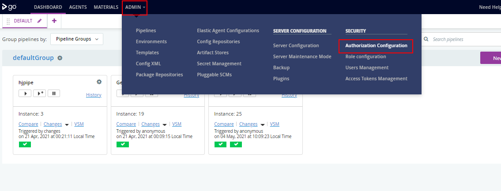

* ID에 admin 를 입력하고 위에서 생성한 패스워드 경로를 입력합니다. 
* Allow only known users to login 에 체크합니다. (해당 파일에 여러 User가 등록되 있어도 Id 입력 user만 허용한다라는 의미)

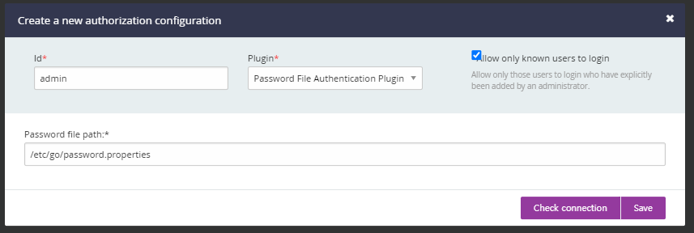

#### 4.4.2. script-executor 

* GoCD는 번들로 제공하는 Task 플러그인이 Ant , NAnt , Rake 만 있습니다. (해당 플러그인들이 Agent에 명령을 실행할 수 있게 해주지는 않는다. 예를 들어 Ant 플러그인 사용시 Agent Node에 ant를 설치해야 합니다.)
* 대부분의 쉘스크립 동작은 일반 Custom Command로 수행 가능합니다. 하지만 심도 깊은 쉘스크립트 동작을 Task로 수행해야 한다면 플러그인을 설치해야합니다. 
* script-excutor는 번들로 제공하는 플러그인이 아니기 때문에 수동으로 다운로드 받아야 합니다.

* gocd server node 에 **ssh로 접속 후** script-executor 플러그인 다운로드 합니다. 
* root 권한으로 수행해야 합니다.

~~~bash
cd /var/lib/go-server/plugins/external
wget https://github.com/gocd-contrib/script-executor-task/releases/download/0.3/script-executor-0.3.0.jar
~~~

* go-server 재기동 합니다.

~~~bash
systemctl stop go-server
systemctl start go-server
~~~

* 아래와 같은 **Plugin Task**가 생긴 것을 확인 할 수 있습니다.

> [참고]  maven plugin (deprecated)
>
> Maven Task Plugin 은 현재 버전에서 정상 동작하지 않는 것으로 확인했습니다.  (2021.05.03)
>
> Custom Command로 maven build를 수행하도록 합니다.

## 5. GoCD Agent 구성

### 5.1. requirements

* **Hardware**
  * **RAM** - minimum 128MB, 256MB recommended
  * **CPU** - minimum 2GHz

* **Supported Operating Systems**
  * **Windows** - Windows Server 2012, Windows Server 2016, Windows 8 and Windows 10
  * **Mac OSX** - 10.7 (Lion) and above with Intel processor
  * **Debian** - Debian 8.0 and above
  * **CentOS/RedHat** - CentOS/RedHat version 6.0 and above
  * **Ubuntu** - Ubuntu 14 and above
  * **Alpine Linux** - Alpine Linux 3.6 and above
* **Runtime**
  * **Java Runtime** - JRE 13 이상

### 5.2. Install

* <u>**Default Quick 설치는 하지 않습니다.**</u> 

* go agent 는 GoCD server에 8153 port로 주기적으로 신규 Task를 Polling 하여 신규 Job이 있으면 수행하는 구조입니다.
* go-agent를  Binary (zip 파일) Agent 를 다운로드 받아서 설치합니다. go-agent 실행 유저를 go 에서 다른 유저로 바꾸면 정상적으로 동작 하지 않으며 우리는 배포 전략을 위해서 go-agent를 default 로 설정 되어 있는 go 유저가 아닌 WAS 유저로 기동할 필요가 있습니다.

* go 유저로 배포 및 WAS 재기동등을 수행할 때 여러 제약조건이 존재하여 WAS 기동 유저로 권한을 바꾸고자 합니다.  ([공식 다운로드 사이트](https://www.gocd.org/download/#zip) ) ([공식설치문서](https://docs.gocd.org/current/installation/install/agent/zip.html))

~~~bash
wget https://download.gocd.org/binaries/21.2.0-12498/generic/go-agent-21.2.0-12498.zip
unzip go-agent-21.2.0-12498.zip
cp -R go-agent-21.2.0 /app/
~~~

* go-agent 는 JRE13이상이 필요하기 때문에 OpenJDK13을 별도로 받아서 설치합니다 (yum으로 설치할 때는 패키지 안에 설치되어 있음)

~~~bash
wget https://download.java.net/openjdk/jdk13/ri/openjdk-13+33_linux-x64_bin.tar.gz
tar zxvf openjdk-13+33_linux-x64_bin.tar.gz -C /app/go-agent-21.2.0/
~~~

* go-agent 환경설정
  - 환경설정 파일 : /app/go-agent-21.2.0/wrapper-config/wrapper-properties.conf
  - wrapper.app.parameter.101 는 GoCD 서버 접속 URL을 입력합니다.
  - wrapper.java.command 는 GoCD Agent를 기동할 Java 경로를 입력합니다.

~~~bash
wrapper.app.parameter.101=http://3.36.174.240:8153/go
wrapper.java.command=/app/go-agent-21.2.0/jdk-13/bin/java
~~~

* go-agent 시작 (WAS 유저)

~~~bash
cd /app/go-agent-21.2.0/bin
./go-agent start
~~~

* WEB UI 화면에 가서 Pending 중인 agent를 ENABLE 설정하면 됩니다.

### 5.3. 서비스 데몬으로 등록 (Optional)

* 기본적인 systemctl 서비스 데몬 시스템으로 등록하기 위해 다음과 같은 설정을 할 수 있습니다. (root 권한 실행)

* 데몬을 구동할 서비스 유저를 명시적으로 wasuser로 선언해 줄 것 입니다.

* go-agent.service 파일 작성합니다.

  ~~~bash
  [root@gocdclient1 system]# vi /usr/lib/systemd/system/go-agent.service
  [Unit]
  Description=go-agent
  After=syslog.target
  
  [Service]
  Type=forking
  ExecStart=/app/go-agent-21.2.0/bin/go-agent start sysd
  ExecStop=/app/go-agent-21.2.0/bin/go-agent stop sysd
  User=wasuser
  KillMode=control-group
  Environment=SYSTEMD_KILLMODE_WARNING=true
  
  [Install]
  WantedBy=multi-user.target
  ~~~

* 신규 데몬 등록 및 OS 부팅시 자동 실행 등록합니다.

  ~~~bash
  systemctl daemon-reload
  systemctl enable go-agent
  ~~~

* 데몬 실행 및 정상 구동 여부 확인합니다.

  ~~~bash
  systemctl start go-agent
  systemctl status go-agent
  ● go-agent.service - go-agent
     Loaded: loaded (/usr/lib/systemd/system/go-agent.service; enabled; vendor preset: disabled)
     Active: active (running) since 일 2021-05-23 22:25:27 KST; 10min ago
   Main PID: 2660 (wrapper-linux-x)
     CGroup: /system.slice/go-agent.service
             ├─2660 /app/go-agent-21.2.0/bin/../wrapper/wrapper-linux-x86-64 /app/go-agent-21.2.0/bin/../wrapper...
             ├─2683 /app/go-agent-21.2.0/jdk-13/bin/java -Djava.library.path=wrapper -classpath wrapper/wrapper....
             └─2732 /app/go-agent-21.2.0/jdk-13/bin/java -Xms128m -Xmx256m -Dagent.plugins.md5=9a87d587cb2464850...
  
   5월 23 22:25:24 gocdclient1 systemd[1]: Starting go-agent...
   5월 23 22:25:24 gocdclient1 go-agent[2594]: Starting go-agent...
   5월 23 22:25:27 gocdclient1 go-agent[2594]: Waiting for go-agent......
   5월 23 22:25:27 gocdclient1 systemd[1]: Started go-agent.
  ~~~

  >  필수적으로 go-agent 프로세스가 wasuser로 구동 되었는지 확인합니다.

*  

* 

## 6. GoCD Pipeline 구성

### 6.1. 인프라 구성

* 개발자가 소스 코드 커밋을 하고 Gitlab 서버에 push 를 합니다.
* GoCD Server는 Gitlab의 업데이트 사항을 감시하다 변경 점이 생기면 파이프 라인을 구동합니다. 
  (자동으로 파이프라인 구동을 하는 것은 선택사항)
* 파이프라인이 동작을 시작하면 해당 Job을 정책에 따라 GoCD Agent를 할당합니다.
* GoCD Agent들은 GoCD Server에 자신에게 할당 된 Job이 있는지 감시하다, 할당 Job이 있으면 Task를 수행합니다. 
* **인프라 구성도**

###  

### 6.2. 배포 프로세스 구성

- GoCD로 배포 파이프라인을 구성하기 위하여 SpringBoot + Apache Maven  + Apache Ant 으로 구성합니다.
- 소프트웨어 스펙은 Spring Boot 2.4.5 , Apache Maven 3.8.1 , Apache Ant  1.10.10 로 설치합니다.
- GoCD Agent에 파이프라인 구성을 위해 Ant 와 Maven을 설치합니다.  ant와 maven은 최신 버전 설치를 위해 공식 홈페이지에서 binary 파일을 다운로드 합니다. 
- GoCD Agent 서버에 접속하여 파일을 다운로드 받습니다.

~~~bash
wget https://mirror.navercorp.com/apache//ant/binaries/apache-ant-1.10.10-bin.tar.gz
wget https://mirror.navercorp.com/apache/maven/maven-3/3.8.1/binaries/apache-maven-3.8.1-bin.tar.gz
tar zxvf apache-maven-3.8.1-bin.tar.gz -C /usr/share/
tar zxvf apache-ant-1.10.10-bin.tar.gz -C /usr/share/
ln -s /usr/share/apache-maven-3.8.1/bin/mvn /sbin/mvn 
ln -s /usr/share/apache-ant-1.10.10/bin/ant /sbin/ant 
~~~

* **프로세스 흐름도** 

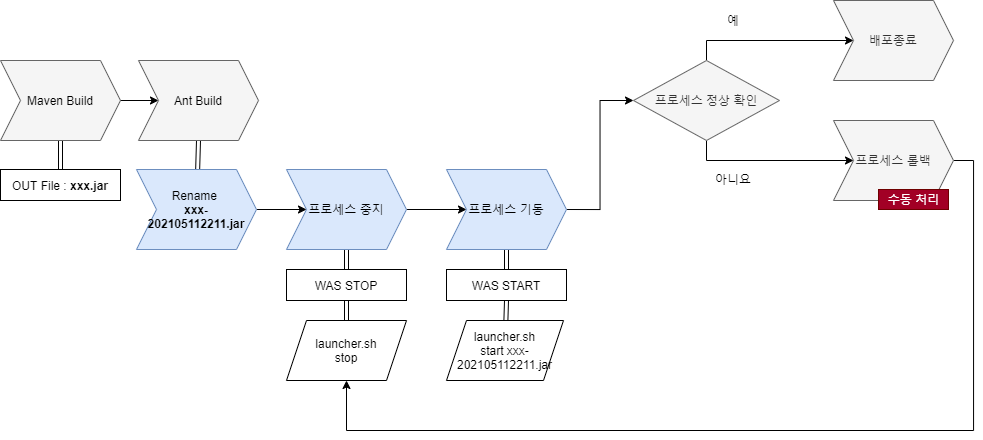

### 6.3. Pipeline 생성

* GoCD Server URL 에 접속하여 로그인을 합니다.
* Dashboard > DEFAULT > New Pipeline > Use Pipeline Wizard
* Part 1: Material  설정 후 Test Connection을 눌러 접속 가능여부 확인합니다. 
  * Type : Git 
  * Repository URL : http://gitlab.cjarchlab.net:8989/arch/springbootweb
  * Username : hjoon
  * Password : "패스워드 입력"

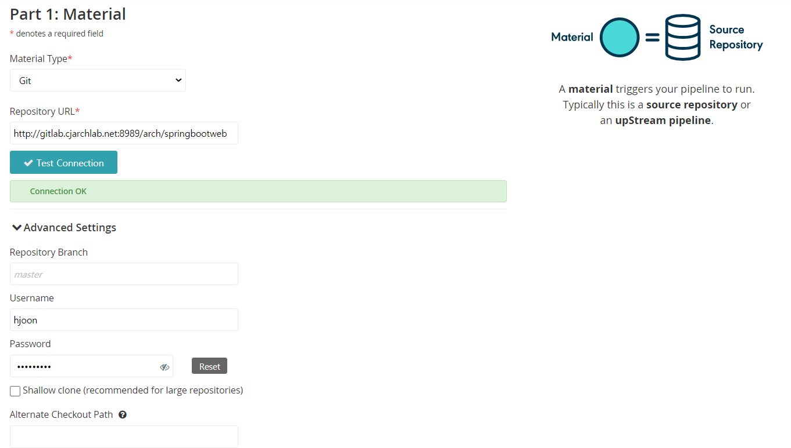

* Part 2: Pipeline 

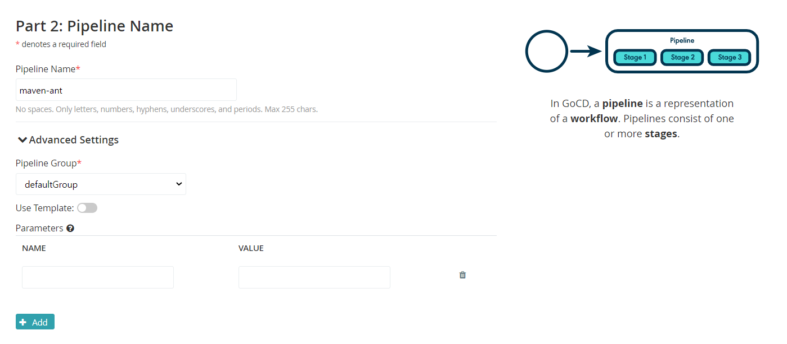

* Part 3: Stage Details
  * Stage Name : maven

* Part 4: Job and Tasks
  * Job Name : maven-package
  * Task : mvn package
  * Advanced Settings > Plain Text Variables 
    * JAVA_HOME = /app/jdk-11

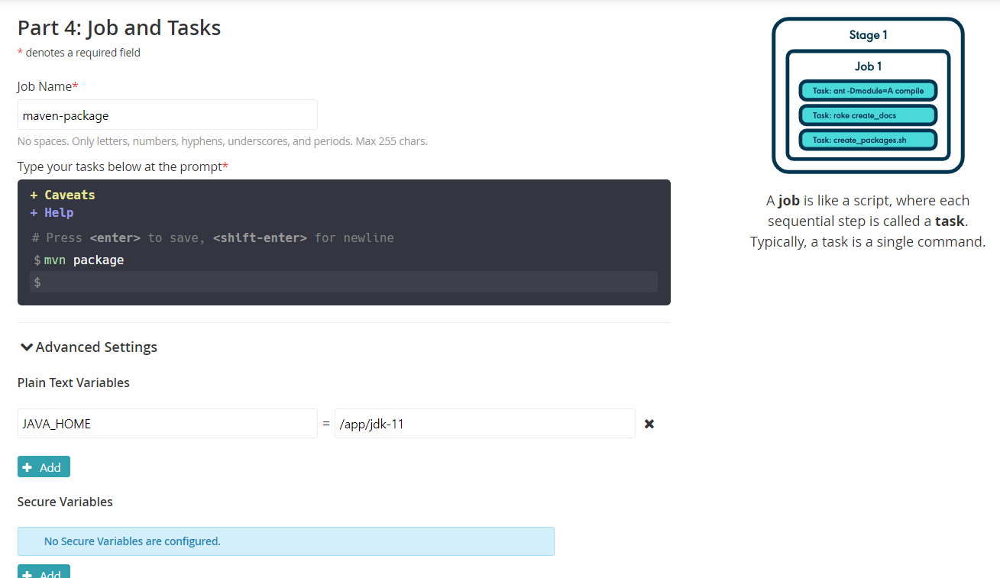

* 'Save + Edit Full Config'  버튼을 눌러서 추가 설정을 진행합니다.

* maven-ant (pipeline) > STAGES > Add new stage

* Add new stage

  * Stage name : ant
  * Allow only on success of previous stage : enable 
  * Job Name : ant-run
  * Task Type : Ant

  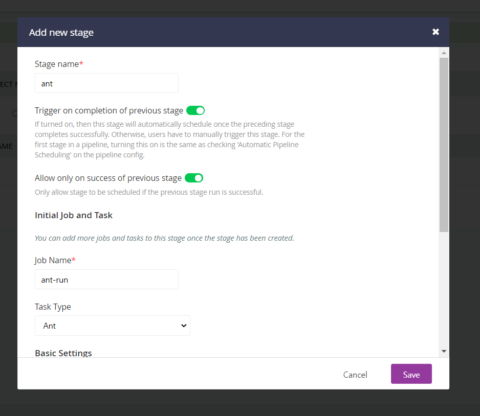

* maven > Stage Setting > Nerver cleanup artifacts : Enable

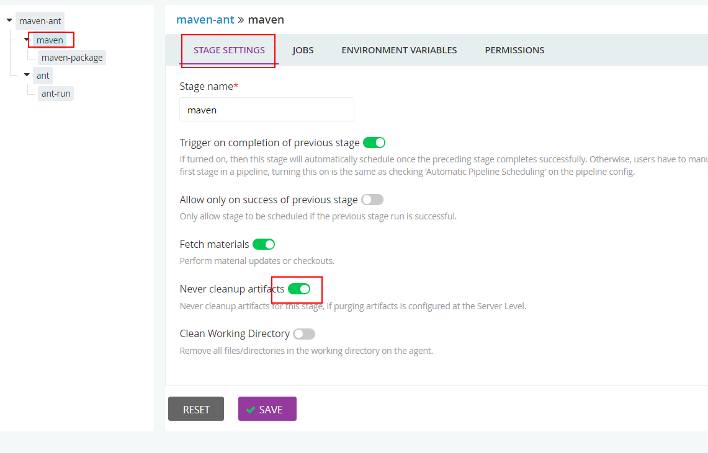

* maven-package >TASKS > Add Task (Custom Command)
  * Command : mvn
  * Arguments  : clean

* mvn clean TASK 를 드래그&드롭으로 맨 위로 올립니다.

* maven-package , ant-run TASK 항목에  환경설정 부분에 JAVA_HOME 이 /app/jdk-11으로 들어가 있는지 확인하고 없으면 입력해 줍니다.

* ant > STAGE SETTINGS 

  * Allow only on success of previous stage : Enable
  * Fetch materials : Disable
  * Never cleanup artifacts : Enable

  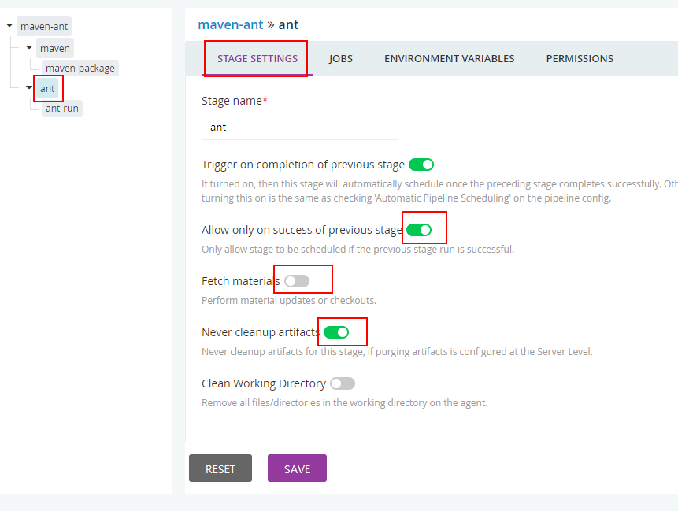

### 6.4 Agent  리소스 그룹 설정

* GoCD Agent 를 위 과정 중에 만든 Pipeline에 할당을 해야 파이프라인의 작업들이 Agent에서 동작을 합니다.
* 하나의 Agent는 여러개의 리소스 이름을 가질 수 있고, 그룹핑도 가능합니다. 이를 통해 여러가지 배포 구성을 만들 수 있습니다.
* 화면 상위 메뉴 AGENTS > static > gocdclient1,2 체크박스 선택 > Environments > 리소스 이름 (deploy) Add  > Apply

* Resources 에 deploy 가 추가 된 것을 확인 할 수 있습니다.

* 다시 Dashborad > Pipeline 의 설정에 들어갑니다.

* maven-package > JOB SETTINGS 

  * Resources : deploy
  * Run Type : Run on all agents
  * SAVE

  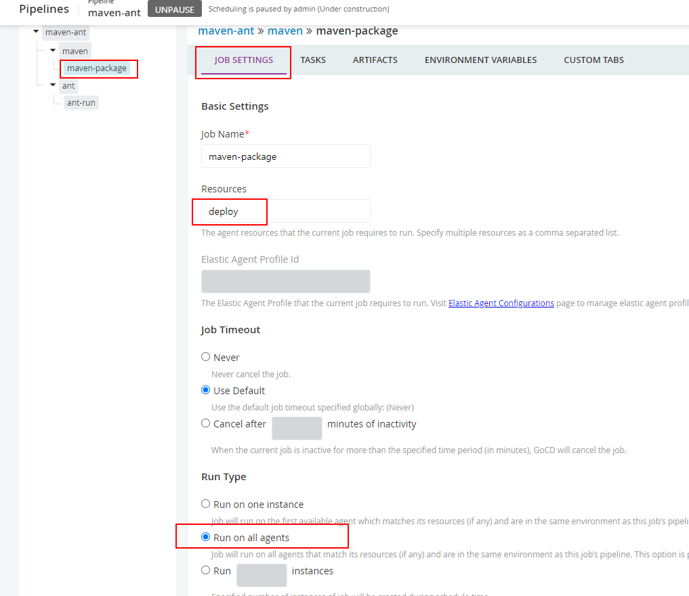

* ant-run JOB Setting 도  위와 동일하게 반복해 줍니다.

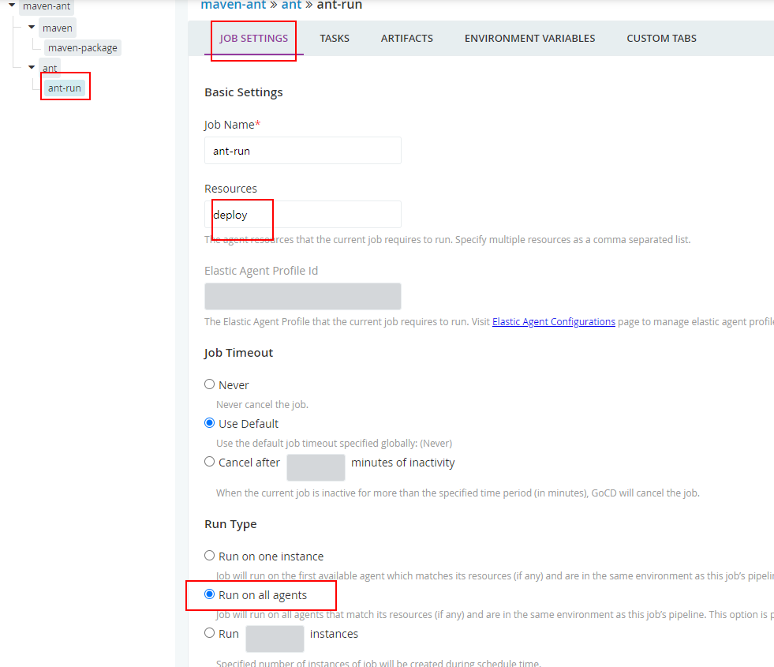

### 6.5 배포 수행

* 위의 과정을 모두 완료 했으면 이제 실행을 해봅니다. 

* 선행 조건  

  * gitlab에 샘플 소스 준비

    * [SpringBoot project Quick Start](http://gitlab.cjarchlab.net:8989/arch/springbootweb) 참고 해서 빠르게 만들기 진행 가능합니다.

  * WAS 동작 환경 준비 ( jar 구동 런처 , 소스디렉토리) 

    * [SpringBoot project Quick Start](http://gitlab.cjarchlab.net:8989/arch/springbootweb) 프로젝트 소스 안에 launcher.sh 를 jar 구동 런처로 사용할 수 있습니다.

    * WAS의 디렉토리 구조는 아래와 같이 만들어 줍니다.

      ~~~bash
      ## WAS 서버 경로 
      # launcher.sh 위치
       /app/was/springboot/bin
      
      # 런처를 이용하여 jar 구동시 stdout 로그 , pid , jar 파일이름 정보 저장 위치
       /app/was/springboot/log
      
      ## 소스 코드 경로 (배포 jar 파일)
       /svcroot/runtime/webapps/springboot
      ~~~

      

* Pipeline 구동

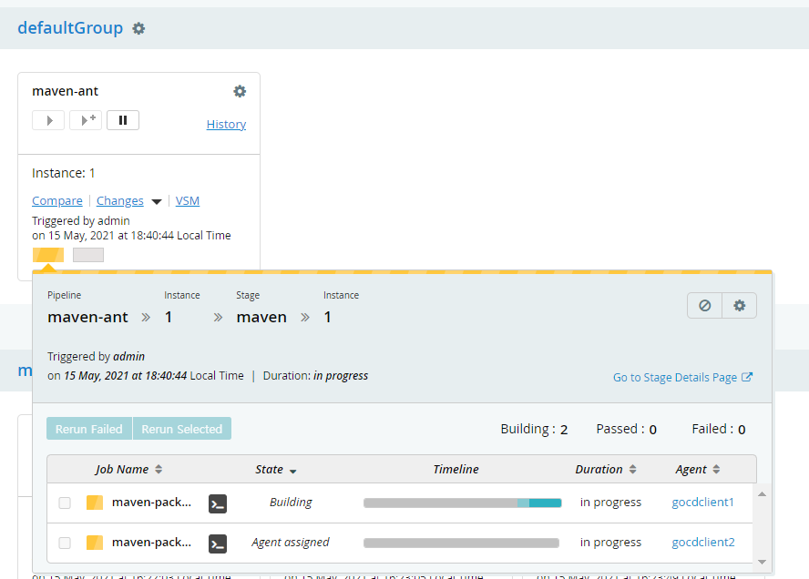

* 를 클릭하면 아래와 같은 수행 터미널 확면을 실시간으로 확인할 수 있습니다. 
 

## 7. 배포 전략 

* 운영 환경에서 시스템을 효과적으로 추적하고 모니터링 할 수 있는 기술과 일이 잘못되었을 때 프로덕션 환경에서 교정 조치를 취할 수 있는 기능이 필요합니다. 운영환경에서 오류 주입 이라는 테스트 범주가 있는데, 운영 환경에서 제어 된 방식으로 오류를 도입하여 시스템이 이러한 오류를 견딜 수 있는지를 확인합니다. 운영환경에서 널리 사용되는 몇가지 특정 배포 전략입니다.

### 7.1 Blue-Green 배포

* Blue/Green 배포는 기존에 실행중인 배포가 그대로 유지하기 위한 기술입니다. 새 버전의 응용 프로그램이 기존 버전과 병렬로 설치됩니다. 새 버전이 준비되면 로드 밸런서 구성을 변경하여 새 버전으로 전환 합니다.

* 이 기술의 기본 아이디어는 사용자를 녹색 서버 세트 또는 파란색 서버 세트로 라우팅 할 수 있다는 것입니다. 이는 여러 가지 방법으로 달성 할 수 있습니다.

  - **로드 밸런서 / 라우터 변경**

    - 이 기술을 사용하면로드 밸런서를 변경하거나 라우터가 Blue 서버 또는 Green 서버를 가리 키도록 요청합니다.

      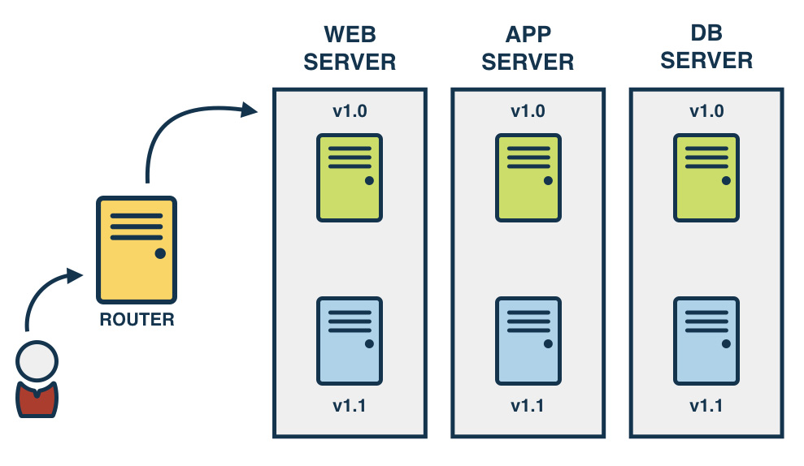

  - **공용 DNS 레코드 변경**

    - 이 기술을 사용하려면 CNAME 또는 A 레코드를 변경하여 DNS 수준에서로드 밸런싱을 수행합니다. 사용자가 웹 사이트에 대한 DNS 항목을 요청하면 DNS 서버가 파란색 서버 또는 녹색 서버에 대한 IP 주소를 반환 할 수 있습니다. **이 특정 접근 방식을 사용하려면 TTL (수명)을 매우 작은 값으로 설정해야합니다.**

    - 일부 DNS 서버에서 실행되는 일부 브라우저는 DNS 항목의 낮은 TTL 값을 존중하지 않고 TTL보다 오래 DNS 레코드를 캐시하기 때문에 이 특정 접근 방식은 공용 DNS 레코드 변경에 권장되지 않습니다. 이로 인해 일부 사용자가 웹 사이트에 액세스하지 못할 수 있습니다.

      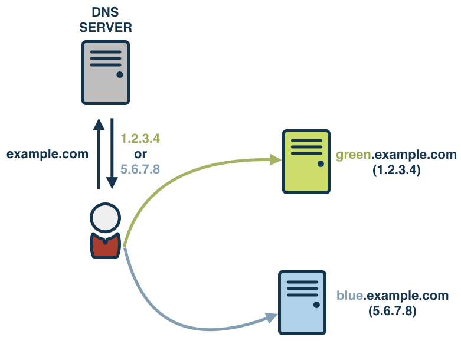

  - **부하 분산기 + 내부 DNS 레코드**

    - 이 접근 방식은 지금까지 본 두 가지 기술의 조합입니다.

    - 이 기술에서는 공용 DNS 레코드를 변경하는 대신 내부 (개인) DNS 레코드를 변경합니다. 내부 네트워크와 DNS 서버는 TTL을 준수하도록 관리 및 구성 할 수 있으므로이 접근 방식은 공용 DNS 레코드를 변경하는 것보다 훨씬 효과적입니다.

      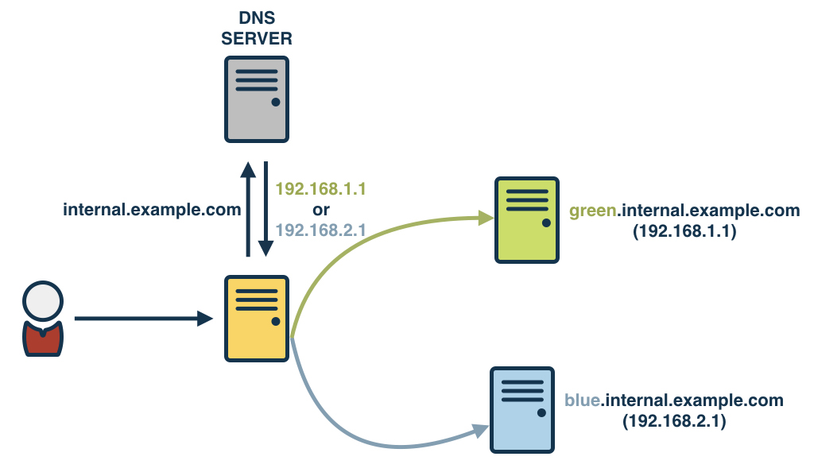

  

### 7.2. Canary 배포

* Canary 배포는 새 릴리즈를 가져와서 운영환경의 인프라 특정 하위 섹션에 배포하고 얼마나 잘 진행 되는지를 확인하고, 완전히 롤 아웃 할 때까지 새 서비스의 설치 공간을 계속 늘립니다. 문제가 발생하면 새 버전의 서비스 롤백을 시작할 수 있습니다.
* Blue / Green 배포와 마찬가지로 서버의 작은 하위 집합에 응용 프로그램을 배포하는 것으로 시작합니다. 서버 하위 집합이 배포되면 몇 명의 사용자에 대한 요청을 새 서버 집합으로 라우팅 할 수 있습니다.
* 이 전략을 사용하면 다음과 같은 많은 흥미로운 작업을 수행 할 수 있습니다.
  - 응용 프로그램의 성능 테스트
  - 인구 통계 및 사용자 프로필을 기반으로 A / B 테스트를 수행합니다 (예 : "서울에 거주하는 20-25 세 사이의 사용자").
  - 일부 베타 테스터 또는 회사의 사용자로부터 피드백 받기
* 배포에 대한 확신이 높아짐에 따라 응용 프로그램을 점점 더 많은 서버에 배포하고 더 많은 사용자를 새 서버로 라우팅 할 수 있습니다. 애플리케이션의 하나 이상의 버전이 일정 기간 동안 운영 환경에서 실행되는 경우 애플리케이션과 해당 구성 요소 (웹 서비스, 마이크로 서비스, 데이터베이스)가 이전 버전의 하나 또는 두 개 이상에서 작동하도록 이전 버전과 호환되어야 합니다. 

## 8. 전략적 배포 수행

* '배포 전략' 에서 소개한 2가지 배포 방식 중 Blue/Green 배포 방식을 적용하여 구성하였습니다.
* **Deploy step1**

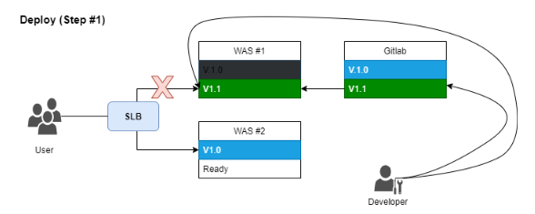

* **Deploy step2**

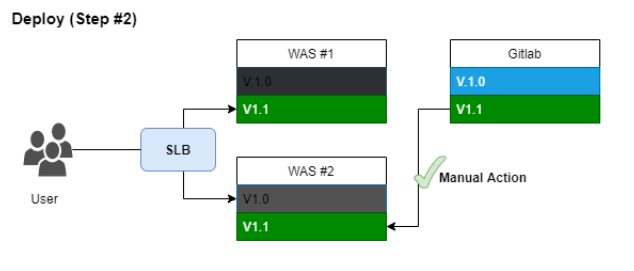

* **Deploy step3**

  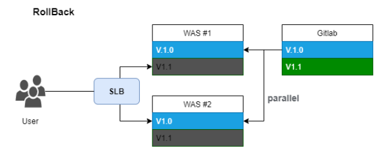

## 9. 롤백 수행

## 10. 마치며

## 참고

* [GoCD 구현  사례](https://www.gocd.org/2018/05/08/continuous-delivery-microservices-test-strategy/)

